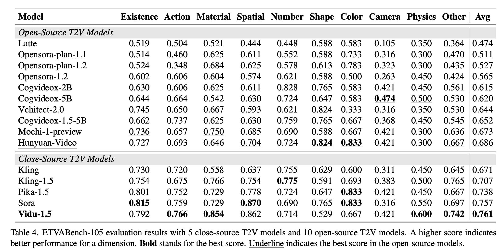
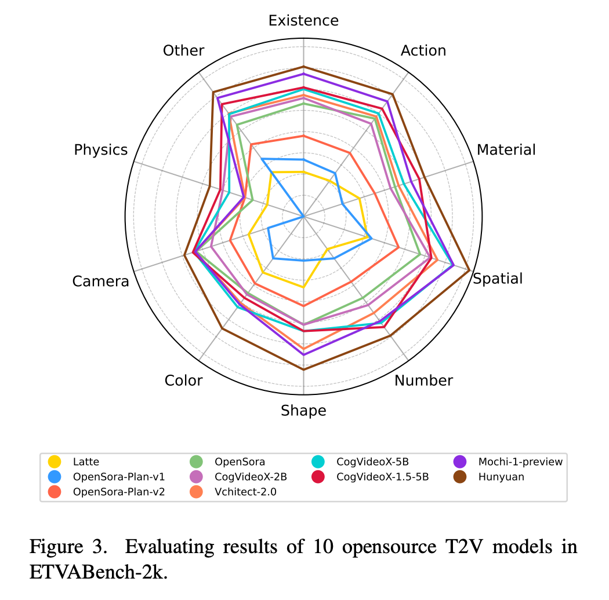

# ETVA: Evaluation of Text-to-Video Alignment via Fine-grained Question Generation and Answering 

[[Paper](https://arxiv.org/abs/2503.16867)] [[Demo page](https://eftv-eval.github.io/etva-eval/)] [[BibTex](#citing-etva)]

We propose **ETVA**, a novel **Evaluation method of Text-to-Video Alignment via fine-grained question generation and answering**. First, a multi-agent system parses prompts into semantic scene graphs to generate atomic questions. Then we design a knowledge-augmented multi-stage reasoning framework for question answering, where an auxiliary LLM first retrieves relevant common-sense knowledge (e.g., physical laws), and then video LLM answer the generated questions through a multi-stage reasoning mechanism. Extensive experiments demonstrate that ETVA achieves a **Spearman’s correlation coefficient of 58.47**, showing much higher correlation with human judgment than existing metrics which attain only 31.0. We also construct a comprehensive benchmark specifically designed for text-to-video alignment evaluation, featuring **2k diverse prompts** and **12k atomic questions** spanning 10 categories. Through a systematic evaluation of **15 existing text-to-video models**, we identify their key capabilities and limitations, paving the way for next-generation T2V generation.

## 🔥Updates

- 05/22/2025 We update ETVA-Bench and evaluatation codes of ETVA.

## 🚗 Getting Started

### Prepare conda environment

```
conda create -n etva python=3.10
https://github.com/guankaisi/ETVA.git
cd ETVA
pip install -r requirements.txt
```

### Downloading Models

First, we need to download LLM model and Multi-modal LLM models to the models folder.

Here, we use following models:

- LLM: [Qwen2.5-72B-Instruct](https://huggingface.co/Qwen/Qwen2.5-72B-Instruct)
- MLLM: [Qwen2-VL-72B-Instruct](https://huggingface.co/Qwen/Qwen2-VL-72B-Instruct)

### Prepare Generated Videos

Here, you should put generated videos in the folder `video_folder`

```
----video_folder
		|----------sora
								|-------0.mp4
								|-------1.mp4
								|
								|-------104.mp4
		|-----------vidu
								|-------0.mp4
								|-------1.mp4
								|
								|-------104.mp4
```

#### Generate Questions

```
python pipeline.py \
	--llm_path <YOUR_LLM_PATH> \
	--prompt_path <YOUR_PROMPT_PATH> \
	--task qg \
	--output_path <YOUR_OUTPUT_PATH>
```

#### Get Common Sense Reasning

```
python pipeline.py \
	--llm_path <YOUR_LLM_PATH> \
	--question_path <YOUR_QUESTION_PATH>
	--task reason \
	--output_path <YOUR_OUTPUT_PATH>
```

#### Answer Generated Questions

```
python pipeline.py \
	--mllm_path <YOUR_MLLM_PATH> \
	--model_name <YOUR_VIDEO_MODEL_NAME>
	--reason_path <YOUR_REASON_PATH>
	--task reflect \
	--output_path <YOUR_OUTPUT_PATH>
```

#### Eval your results

```
python eval.py \
	--eval_path <YOUR_ANSWR_PATH>
```

## 📚Benchmark of Existing Text-to-Video Models

### ✨ Results on ETVA-105



### ✨ Results on ETVA-2k



## ✒️Citing ETVA

```
@article{guan2025etva,
  title={ETVA: Evaluation of Text-to-Video Alignment via Fine-grained Question Generation and Answering},
  author={Guan, Kaisi and Lai, Zhengfeng and Sun, Yuchong and Zhang, Peng and Liu, Wei and Liu, Kieran and Cao, Meng and Song, Ruihua},
  journal={arXiv preprint arXiv:2503.16867},
  year={2025}
}
```

